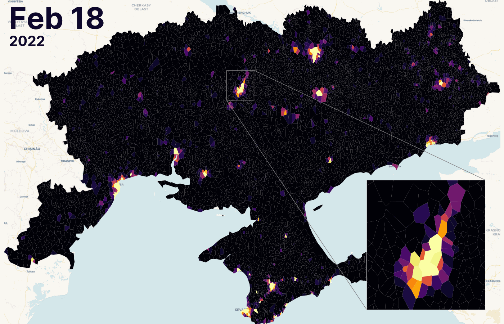

# Black Marble NTL Toolkit

Wars change the night. Electricity networks fail, curfews alter mobility, and cities dim. Satellite observations of nighttime illumination, also known as nighttime lights (NTL), make these disruptions **observable from space**. Through daily products like NASA's Black Marble, NTL provides **crucial situational awareness in conflict settings** where ground-based reporting is delayed, biased, or physically inaccessible. 

While historically limited by low baseline illumination in rural conflict zones, conflicts like the full-scale invasion of Ukraine demonstrate NTL's **immense value in urbanized settings**. By tracing sudden radiance drops, humanitarian organizations and researchers can **track the progression of the war** and support response efforts in hard-to-reach areas.

<figure markdown>
  
    <figcaption>Nighttime radiance fluctuations captured at the onset of full-scale invasion by Russia on 24 February 2022 over Southern Ukraine.
    </figcaption>
</figure>

To lower the technical barriers associated with retrieving, processing, and analyzing these large-scale datasets, the **Black Marble NTL Toolkit** provides a streamlined Python interface. This package includes helper functions designed to facilitate independent experimentation with NTL data for researchers and data engineers alike.

## Key Features

- **Data Retrieval:** Easily download NASA's Black Marble daily and annual products via Google Earth Engine.
- **Preprocessing Pipeline:** A customizable, memory-efficient pipeline leveraging Dask and Xarray for filtering out clouds, correcting geometric and angular distortions, and filling data gaps.
- **Spatial Aggregation:** Aggregate pixel-level data to custom geometries like administrative boundaries for robust longitudinal analysis.

Head over to the [Getting Started](content/get_started/index.md) section to install the package and configure your environment, or check out the [User Guide](content/user_guide/index.md) to dive straight into the code.
